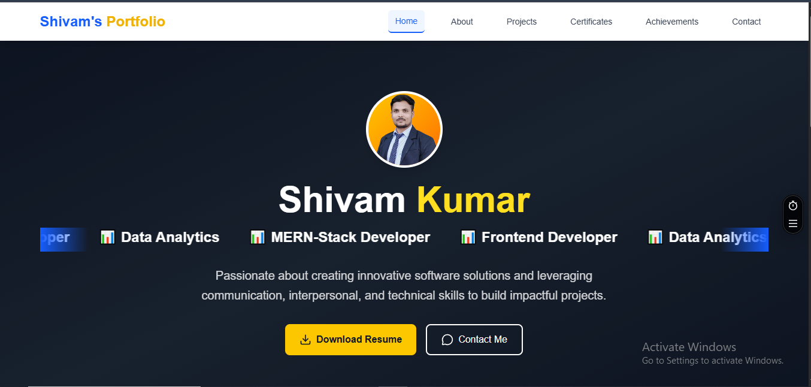

# 📸 Website Screenshots

Example:

- 

🚀 Portfolio & Achievements Website

A modern, responsive personal portfolio & achievement showcase built using React.js and Tailwind CSS.
This project highlights my projects, internships, certifications, and national-level achievements with a clean, professional UI.

📌 Project Overview

This portfolio website is designed to present my technical journey and achievements in a structured and visually appealing way.
It includes:

🧑‍💻 Projects showcase

🏆 Internship achievements

📜 Certifications

🏅 National-level competitions (GOER 2025, RMAT, etc.)

The UI is inspired by modern SaaS dashboards with dark theme, cards, and smooth layouts.

✨ Key Features

⚛️ Built with React.js

🎨 Styled using Tailwind CSS

🌙 Dark theme professional UI

📱 Fully responsive (Mobile, Tablet, Desktop)

🏆 Dedicated Achievement Pages

📜 Certificate & Internship details

🔗 External links (GitHub, Live Projects, Certificates)

🧩 Reusable components

🚫 Inspect disable hook (basic protection)

🏗️ Tech Stack
| Technology | Usage |
| --------------------- | ------------------ |
| **React.js** | Frontend framework |
| **Tailwind CSS** | Styling & UI |
| **Lucide React** | Icons |
| **JavaScript (ES6+)** | Logic |
| **HTML5** | Structure |
| **CSS3** | Styling |

📂 Project Structure
src/
│── components/
│ ├── Navbar.jsx
│ ├── Footer.jsx
│ ├── Layout.jsx
│
│── pages/
│ ├── Projects.jsx
│ ├── ProjectDetail.jsx
│ ├── Certificates.jsx
│ ├── InternshipAchievement.jsx
│ ├── GOERAchievement.jsx
│
│── data/
│ ├── projects.js
│ ├── certificates.js
│
│── hooks/
│ └── useDisableInspect.js
│
│── App.jsx
│── main.jsx

🏆 Major Achievements Highlighted
🎯 GOER 2025 – National Level Competition

Selected among Top 10 Universities in India

Organized by Institute of Risk Management (IRM), India

Final round held at SDA Bocconi Asia Center, Mumbai

Team: Intrepid Explorers (MCA) – AKS University, Satna

📊 RMAT – Risk Management Aptitude Test

Score: 96% (240 / 250)

Skills assessed:

Business Logic

Analytical Reasoning

Decision Making

Risk Thinking

🧑‍💼 Internship Experience

Data Analysis Intern – Shanti Infosoft, Indore

Data Cleaning & Manipulating

Get meaningfull insight

Visualization

Worked with modern tech stack

Mentored & collaborated in a team environment

📜 Certifications Section

AWS Training (Anudip Foundation)

Core Java Certification

IBM / Microsoft / Forage Programs

RMAT & GOER Participation Certificates

Internship & Appreciation Certificates

All certificates are displayed in a structured card-based UI.

▶️ How to Run the Project Locally

# Clone repository

git clone https://github.com/15shivamgit/Portfolio_v1.git

# Go to project directory

cd your-portfolio

# Install dependencies

npm install

# Start development server

npm run dev

🌐 Live Demo

🔗 Live Portfolio: https://portfolio-v1-8gktb982s-15shivamgits-projects.vercel.app/

📈 Future Improvements

🖼️ Certificate image slider

📊 Timeline-based achievements

🧾 Downloadable resume section

🔍 Advanced filters for projects

🌐 SEO optimization

🤝 Connect With Me

GitHub: https://github.com/15shivamgit

LinkedIn: (https://www.linkedin.com/in/15shivambgs/)

Portfolio: (https://portfolio-v1-8gktb982s-15shivamgits-projects.vercel.app/)
